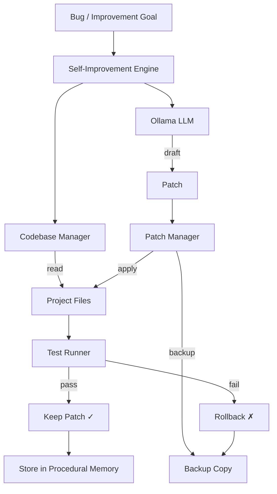

# Jarvis V2 — Self-Debugging & Self-Patching System

Adds real supervised self-improvement with validation and rollback.

## Architecture

## Proposed Changes

### Phase 1: Core Infrastructure

---

#### [NEW] [codebase_manager.py](file:///c:/Users/DELL/OneDrive/Desktop/Test/codebase_manager.py)
- File enumeration, read/write with safety restrictions
- Backup creation before any edit, restore from backup
- Diff generation, editable path validation
- Only allows [.py](file:///c:/Users/DELL/OneDrive/Desktop/Test/brain.py), `.json`, `.yaml`, `.toml`, [.md](file:///C:/Users/DELL/.gemini/antigravity/brain/b3c8ba79-690f-417a-b53f-478a0da2426e/task.md)
- Blocks system files, binaries, databases, OS directories

#### [NEW] [patch_manager.py](file:///c:/Users/DELL/OneDrive/Desktop/Test/patch_manager.py)
- Full rewrite and targeted snippet replacement
- Patch history with metadata (id, path, reason, diff, status)
- Rollback by restoring backup
- Status tracking: applied → verified / rolled_back / failed

#### [NEW] [test_runner.py](file:///c:/Users/DELL/OneDrive/Desktop/Test/test_runner.py)
- `py_compile` validation, smoke tests, pytest support
- Stdout/stderr/exit code capture with timeout
- Before/after comparison for patch validation

---

### Phase 2: Integration

---

#### [MODIFY] [jarvis.py](file:///c:/Users/DELL/OneDrive/Desktop/Test/jarvis.py)
- New action handlers: `read_code`, `search_code`, `apply_patch`, `run_tests`, `rollback_patch`, `self_improve`
- User commands: "show last patch", "patch history", "show diff", "rollback", "self-check"

#### [MODIFY] [memory.py](file:///c:/Users/DELL/OneDrive/Desktop/Test/memory.py)
- New tables: `patch_log`, `self_improvement_log`
- Methods: `log_patch()`, `log_self_improvement()`, `get_recent_patches()`
- Successful fixes stored as procedural memory

---

### Phase 3: Intelligence

---

#### [NEW] [self_improvement.py](file:///c:/Users/DELL/OneDrive/Desktop/Test/self_improvement.py)
- Full debug-and-patch pipeline: analyze → plan → patch → test → keep/rollback
- Safety policy: safe / restricted / forbidden scopes
- Built-in skills: `debug_traceback`, `patch_runtime_bug`, `improve_module_safely`, `self_check`

#### [MODIFY] [planner.py](file:///c:/Users/DELL/OneDrive/Desktop/Test/planner.py)
- Self-improvement intent detection
- Plan templates for "fix bug", "debug yourself", "improve module"

#### [MODIFY] [ai_brain.py](file:///c:/Users/DELL/OneDrive/Desktop/Test/ai_brain.py)
- New tool rules for code actions
- Rule patterns for self-improvement commands

---

### Phase 4: Audit & Evaluation

---

#### [MODIFY] [evaluator.py](file:///c:/Users/DELL/OneDrive/Desktop/Test/evaluator.py)
- `evaluate_patch()`: did symptom disappear? compile pass? new errors? minimal change?
- Benchmark: code health check category

---

### Phase 5: Autostart

---

#### [NEW] [autostart.py](file:///c:/Users/DELL/OneDrive/Desktop/Test/autostart.py)
- Creates Windows startup shortcut via `startup` folder
- Runs Jarvis as background process on login
- Install/uninstall commands

## Verification Plan

### Automated
- All files pass `py_compile`
- Self-check command runs successfully
- Patch → rollback cycle works on a test file

### Manual
- Tell Jarvis "debug yourself" and verify the full pipeline
- Tell Jarvis "show patch history" and verify audit trail
- Reboot laptop and verify Jarvis autostart
